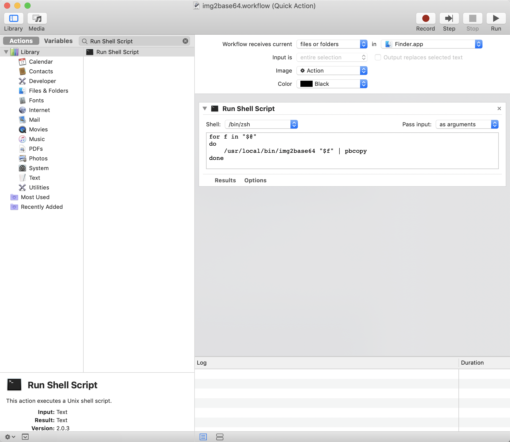

# img2base64

## usage

```
cargo run some.svg
```

## on macOS

First, after building the current project, copy the executable file to `/usr/local/bin` or `/usr/bin` directory.

```bash
cargo build --release
cp ./target/release/img2base64 /usr/local/bin
```

U can open **Automator** and then create a new **Quick Action**, select Run Shell Script and input the following content:

```bash
for f in "$@"
do
  /usr/local/bin/img2base64 "$f" | pbcopy
done
```

**(ps: Pass input: as arguments)**



Now, u can save it first, then right-click on the image u want to convert to bring up the **Quick Actions**, and use the program. It will automatically put the converted content into the clipboard.
